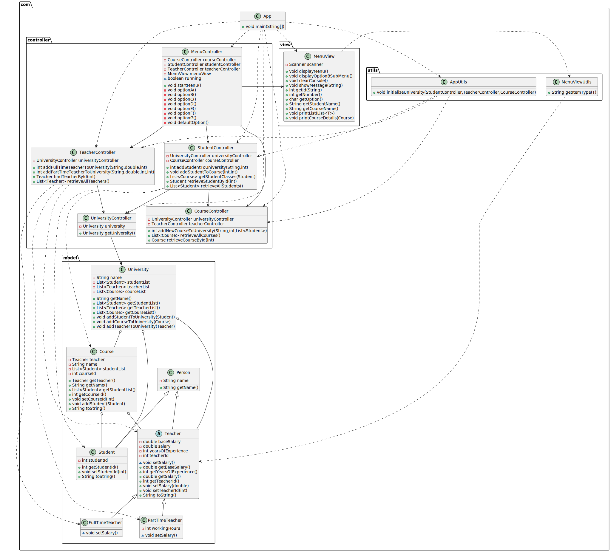

# University Management System

## Overview

The University Management System is a console-based application designed to manage a university's operations. This application allows users to manage teachers, courses, and students, using a console-based menu interface for performing operations.

## Features

- **Teacher Management**: View all teachers in the university.
- **Course Management**: View all courses, view detailed course information, and add new courses with assigned teachers and students.
- **Student Management**: View all students, add new students to courses, and view all courses a student is enrolled in.
- **Simple Console Interface**: Navigate through options using a text-based menu system.

## Usage

Upon running the application, you will be presented with a menu. Use the corresponding letter to navigate through options:

- **a**: Display all teachers.
- **b**: Display all courses or detailed course information.
- **c**: Add a new student and enroll them in a course.
- **d**: Add a new course and assign a teacher and students.
- **e**: View all courses a student is enrolled in.
- **f**: Display all students.
- **g**: Exit the application.

## UML Diagram

